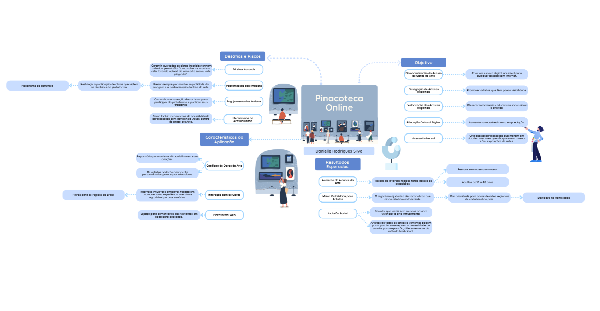
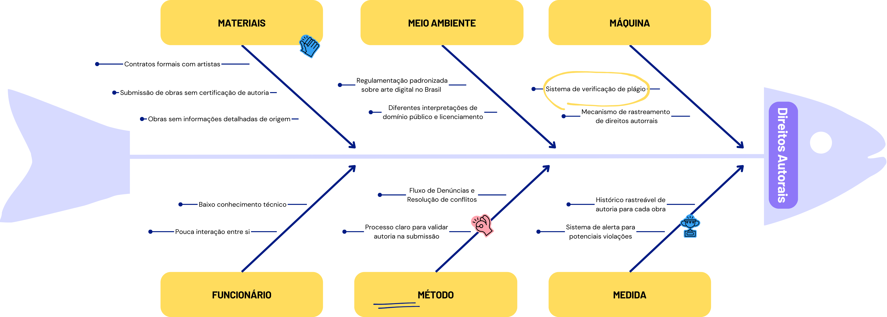
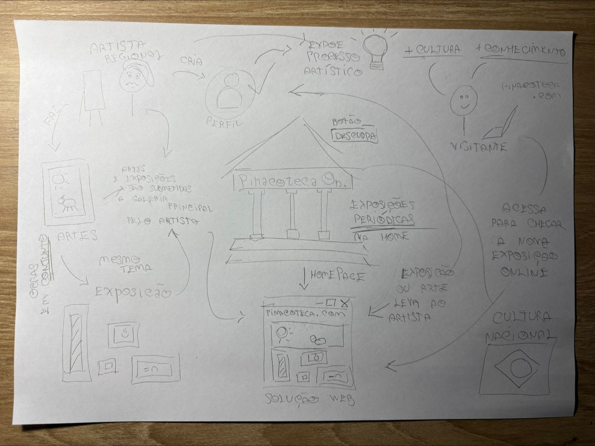
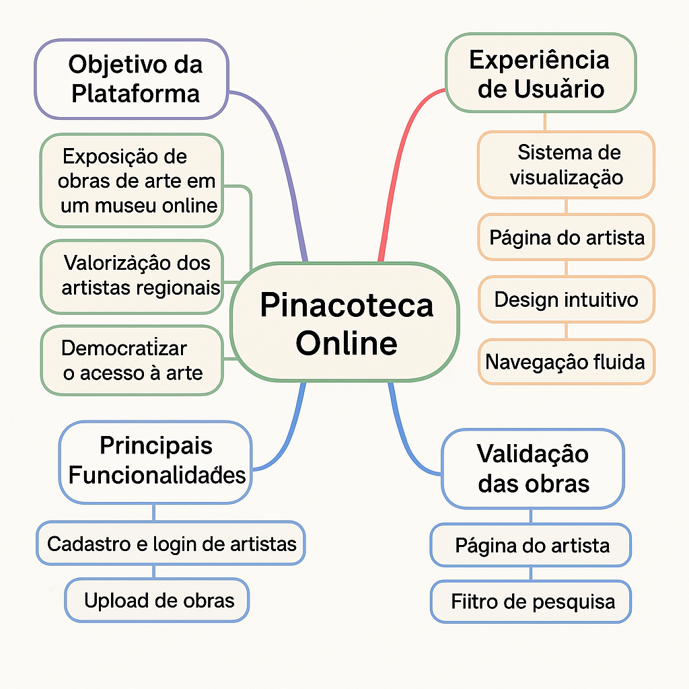
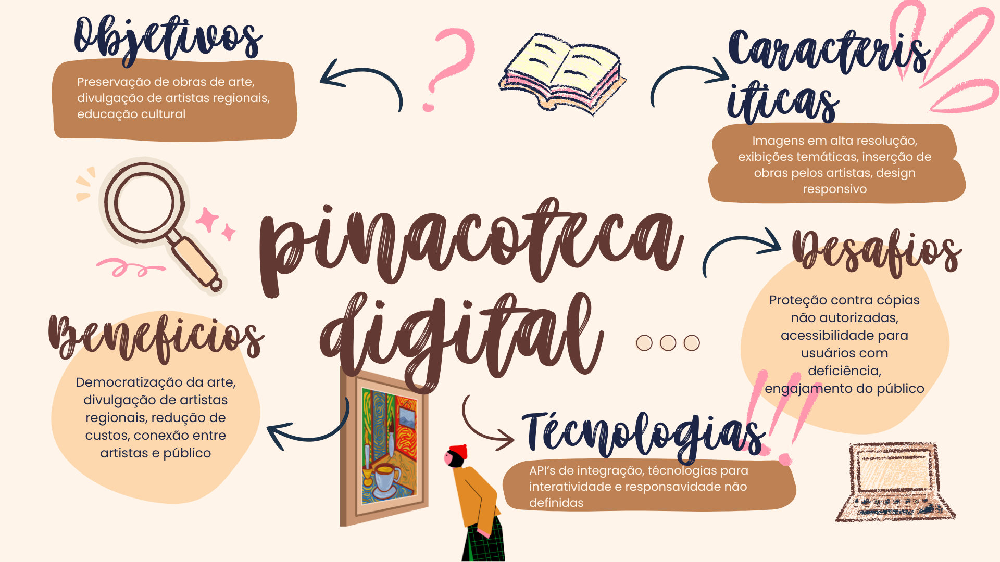

## 📍 Design Sprint – Etapa 2: Sketch

Durante a segunda etapa da Design Sprint **"Sketch"** cada um dos integrantes da equipe se responsabilizou na produção de um artefato generalista, de sua preferência.

---

### Artefatos Generalistas:

  
<strong>📄 5W2H – Alana Gabriele</strong>

  #### *What (O quê)?*
Desenvolver uma Pinacoteca Online, uma plataforma virtual para exposição de obras de arte de forma digital, podendo ser acessada via site.

#### *Why (Por quê)?*
Para democratizar o acesso à arte e cultura, ampliar o alcance de acervos artísticos e promover a inclusão digital em ambientes culturais. Também visa estimular o ensino da arte e a valorização de artistas independentes ou acervos digitais.

#### *Where (Onde)?*
A plataforma será online, acessível de qualquer lugar por meio de navegadores (site). O foco inicial será o público brasileiro, com possibilidade de expansão internacional.

#### *When (Quando)?*
Início do desenvolvimento em março de 2025 até julho de 2025

#### *Who (Quem)?*
Equipe do Projeto:
- Alana Gabriele Amorim Silva  
- Danielle Rodrigues Silva  
- Davi Rodrigues da Rocha  
- Felipe de Sousa Coelho  
- Jesús Gabriel  
- Leandro Almeida Rocha Santos  
- Lucas Heler Lopes  
- Marllon Fausto Cardoso  
- Mateus Cavalcante de Sousa  
- Renan Araújo  

Público-alvo: Estudantes, professores, pesquisadores, apreciadores de arte, artistas, escolas e universidades, além do público geral interessado em cultura.

#### *How (Como?)*
- Pesquisa e análise de plataformas já existentes;  
- Planejamento do MVP com funcionalidades básicas: busca de obras, exposições, perfis de artistas, acessibilidade e responsividade.  
- Desenvolvimento com tecnologias web (*React, Angular ou Vue*)  
- Testes de usabilidade com usuários reais  
- Adoção de melhorias contínuas com base no feedback dos usuários

#### *How much (Quanto?)*
O investimento estimado dependerá da escala do projeto e dos recursos utilizados. Mas, a princípio não terá custos financeiros.

---

  
<strong>🧠 Mapa Mental – Danielle Rodrigues</strong>

  

  
<strong>📊 Diagrama Ishikawa – Davi Rodrigues</strong>

  

  
<strong>📄 5W2H – Felipe de Sousa</strong>

#### **O quê? (What?)**
Iremos montar o software _Pinacoteca Online_ no formato de um projeto Web.

#### **Por que? (Why?)**
Inserir-se no meio da arte é um processo longo e, muitas vezes, frustrante para diversos artistas iniciantes e aspirantes.  
Nossa ideia é facilitar a divulgação de artistas, com foco em diferentes regiões do Brasil, e democratizar o acesso a essas obras por pessoas que, por vezes, nunca tiveram a oportunidade de frequentar espaços de exposições de arte.

#### **Onde? (Where?)**
Como citado anteriormente, inicialmente temos a ideia de criar uma aplicação **Web**, que será disponibilizada ao público geral — com enfoque nas personas do projeto — ao longo do desenvolvimento.
A escolha de tecnologias ainda será feita, mas já foi decidido que a aplicação terá foco em **UI/UX**, visando retenção e atratividade dos usuários.

#### **Quem? (Who?)**
A equipe conta com 10 membros:
- Alana Gabriele Amorim Silva  
- Danielle Rodrigues Silva  
- Davi Rodrigues da Rocha  
- Felipe de Sousa Coelho  
- Jésus Gabriel  
- Leandro Almeida Rocha Santos  
- Lucas Heler Lopes  
- Marllon Fausto Cardoso  
- Mateus Cavalcante de Sousa  
- Renan Araújo  

A professora **Milene Serrano** e IAs generativas também poderão ser consultadas para sugestões e auxílio no desenvolvimento.

#### **Quando? (When?)**
O projeto teve início no final de **março de 2025** e terá atualizações constantes até, pelo menos, **julho de 2025**.

#### **Como? (How?)**
A equipe deverá seguir uma metodologia ágil, a ser definida entre os membros, dentre as opções:
- RUP  
- OpenUp  
- XP  
- Scrum  
- SAFe  
- Lean  
- Kanban

#### **Quanto custa? (How much?)**
O custo da aplicação pode variar bastante.  
Inicialmente, os principais custos serão:
- **Hospedagem** do sistema em um servidor para acesso externo contínuo.  
- **Horas de trabalho** dos membros da equipe para desenvolvimento e manutenção.

---

  
<strong>📄 5W2H – Jésus Gabriel</strong>

    

#### What? (O que?)
Objetivo: Criar uma plataforma digital para visualização virtual de obras de
arte de pinacotecas, proporcionando uma experiência interativa e acessível.
#### Why? (Por quê?)
Importância: Democratizar o acesso à arte e cultura, permitindo que
usuários de todo o mundo explorem coleções artísticas sem limitações
físicas.
#### Where? (Onde?)
Local de Implementação: Plataforma online (site) acessível globalmente,
em dispositivos móveis e desktops.
#### When? (Quando?)
Prazo: Primeira versão será lançada, com funcionalidades básicas, com
futuras atualizações previstas.
#### Who? (Quem?)
Equipe: Estudantes de Engenharia de Software da UNB. Público-alvo:
estudantes, educadores e amantes da arte.
#### How? (Como?)
Execução: Desenvolvimento ágil com Kanban, utilizando tecnologias como
HTML5, CSS, JavaScript, e React. Design centrado no usuário com
ferramentas como Figma.
#### How Much? (Quanto?)
Custo: Projeto acadêmico sem custos externos significativos, com
investimentos futuros para marketing e manutenção

---

  
<strong>🖼️ Rich Picture – Leandro Almeida</strong>

  

  
<strong>📚 Léxico e Glossário – Lucas Heler</strong>

  

  <iframe loading="lazy" style="position: absolute; width: 100%; height: 100%; top: 0; left: 0; border: none; padding: 0;margin: 0;"
    src="https://www.canva.com/design/DAGjiLlIjxY/mfY88H7t-BQVbYBAboS7lw/watch?embed" allowfullscreen="allowfullscreen" allow="fullscreen">
  </iframe>

<a href="https:&#x2F;&#x2F;www.canva.com&#x2F;design&#x2F;DAGjiLlIjxY&#x2F;mfY88H7t-BQVbYBAboS7lw&#x2F;watch?utm_content=DAGjiLlIjxY&amp;utm_campaign=designshare&amp;utm_medium=embeds&amp;utm_source=link" target="_blank" rel="noopener">Glossário - Pinacoteca Arq&amp;Des</a> de Lucas Heler Lopes

  
<strong>📄 5W2H – Marllon Fausto</strong>

#### 1. What (O quê)?
Desenvolver uma plataforma online interativa e intuitiva.
Permitir que artistas regionais divulguem suas obras (música, artes visuais, literatura, etc.).
Conectar artistas com o público, produtores e outros profissionais da área.
Criar um espaço para a promoção da cultura regional.

#### 2. Why (Por quê)?
Para dar visibilidade a artistas regionais que, muitas vezes, não têm acesso a grandes plataformas.
Para valorizar a cultura local e fortalecer a identidade regional.
Para criar um espaço de conexão entre artistas e o público.
Para impulsionar a economia criativa local.

#### 3. Who (Quem)?
Equipe de desenvolvimento de software (programadores, designers, etc.).
Artistas regionais de diversas áreas.
Público interessado em arte e cultura regional.
Produtores culturais, curadores e outros profissionais da área.
Parceiros (prefeituras, associações culturais, etc.).

#### 4. Where (Onde)?
Plataforma online (site e aplicativo).
Redes sociais para divulgação.
Eventos e festivais culturais (parcerias).
Espaços culturais locais (parcerias).

#### 5. When (Quando)?
Desenvolvimento da plataforma: cronograma a ser definido.
Lançamento da plataforma: data a ser definida.
Atualizações e melhorias contínuas.
Eventos e ações de divulgação: cronograma a ser definido.

#### 6. How (Como)?
Desenvolvimento de um site e aplicativo com design atraente e fácil de usar.
Criação de perfis de artistas com portfólio, biografia e informações de contato.
Ferramentas de busca e filtro para facilitar a descoberta de artistas e obras.
Espaço para interação entre artistas e o público (comentários, mensagens, etc.).
Integração com redes sociais e outras plataformas de divulgação.
Criação de conteúdo relevante sobre a cultura regional (notícias, entrevistas, etc.).
Realização de eventos online e presenciais (lives, workshops, etc.).
Parcerias com espaços culturais e eventos locais.

#### 7. How much (Quanto)?
Orçamento detalhado a ser definido (desenvolvimento, manutenção, marketing, etc.).
Busca por patrocínios e apoios financeiros.
Modelos de monetização sustentáveis (assinaturas, comissões, etc.).

Considerações adicionais:
É importante realizar pesquisas de mercado para entender as necessidades dos artistas e do público.
A plataforma deve ser acessível e inclusiva, com recursos para pessoas com deficiência.
A segurança dos dados dos usuários deve ser uma prioridade.
A plataforma deve ser constantemente atualizada e melhorada com base no feedback dos usuários.

---

  
<strong>🧠 Mapa Mental – Matheus Calvacante</strong>

  

  
<strong>🧠 Mapa Mental – Renan Araújo</strong>

  

---

### 🧠 Justificativas e senso crítico

---

## Histórico de Versões

| Versão | Data       | Descrição            | Autor(es)       | Revisor(es)                         | Detalhes da Revisão            |
| ------ | ---------- | -------------------- | --------------- | ----------------------------------- | ------------------------------ |
| 1.0    | 10/04/2025 | Criação do documento | Leandro Almeida | Danielle Rodrigues / Marllon Fausto | Conteúdo corrigido e revisado. |
